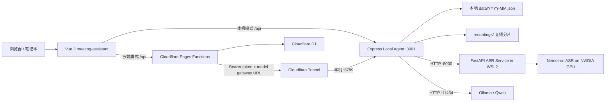

# MeetingRecord Implementation Plan

> **For agentic workers:** REQUIRED SUB-SKILL: Use `superpowers:subagent-driven-development` (recommended) or `superpowers:executing-plans` to implement this plan task-by-task. Steps use checkbox (`- [ ]`) syntax for tracking.

**Goal:** 建成一套可在日历中管理会议、支持本地录音与 NVIDIA ASR 转写、使用本地大模型整理纪要，并可在本机或 Cloudflare 上安全使用的会议记录系统。

**Architecture:** 以 `meeting-assistant` 为唯一产品主线：Vue 3 前端同时兼容本机 Express/JSON 和 Cloudflare Pages Functions/D1。GPU ASR、Ollama 摘要和长录音处理留在本机，通过受保护的本地代理或 Cloudflare Tunnel 提供给前端；`meeting-note-app` 暂作为历史原型，不与主线并行演进。

**Tech Stack:** Vue 3、Vite、Tailwind CSS、Node.js、Express、Cloudflare Pages Functions、D1、FastAPI、Python 3.12、WSL2、PyTorch CUDA、NVIDIA NeMo/Nemotron ASR、Ollama、Node Test Runner、pytest。

---

## 0. 本文件的维护规则

本文件是本项目的长期事实入口，同时承担项目方案、进度记录和续接说明三种职责。

每次开始工作时：

1. 先阅读本文件的“当前快照”“当前进行中”和“下次从这里开始”。
2. 再分别检查主工作区与 ASR 工作树的 `git status`，不要仅凭本文覆盖本地事实。
3. 开始新任务前，在对应路线图任务下增加或细化复选框。

每次结束工作前：

1. 更新“最后更新”“验证基线”“当前进行中”和“下次从这里开始”。
2. 已完成项改成 `- [x]`，未验证的实现不能标记完成。
3. 在“更新日志”追加一条简短记录；保留历史结论，不静默删除。
4. 不在本文写入访问口令、API Key、Tunnel Token 或其他密钥。

状态约定：

- `- [x]`：实现和相应验证均已完成。
- `- [ ]`：尚未完成，或虽有代码但没有完成验收。
- “进行中”：工作区已有未提交修改，必须先保护现场再继续。
- “历史完成、当前异常”：过去曾交付，但当前在线检查不通过。

## 1. 当前快照

最后更新：2026-07-14 13:55（Asia/Shanghai）

### 1.1 产品结论

- 当前主产品是 `meeting-assistant/`。
- `meeting-note-app/` 是较早的 TypeScript + Supabase + PWA 原型；与当前主线的数据模型、UI 和后端均不同，暂不继续双线开发。
- 目标形态是“云端管理数据 + 本机执行重计算”的混合架构，而不是把 GPU 模型部署到 Cloudflare。
- 日常使用入口是云端 `https://meeting-assistant-136.pages.dev`；需要 ASR/摘要时，在台式机双击 ASR 工作树中的 `start-model-tunnel.bat` 并保持窗口运行。
- A“时间地平线”UI 重设计已在 `feature/asr-service` 完成本地实现和浏览器验收，但尚未部署；当前首要任务仍是收敛两处工作树中的未提交改动，形成唯一可发布基线。

### 1.2 Git、分支和工作树

| 位置 | 分支 / 提交 | 状态 | 说明 |
|---|---|---|---|
| 仓库根目录 | `codex/remote-laptop-access` @ `d2eca28` | 进行中 | 有远程访问、模型网关、设置 UI 和测试的未提交修改 |
| 本地 `main` | `d2eca28` | 比 `origin/main` 多 1 个提交 | 仅增加忽略本地工作树的提交 |
| `.worktrees/asr-service` | `feature/asr-service` @ `0cc9c1c` | 进行中 | 已包含 UI 重设计及 Playwright 验收提交，另有 `App.vue`、云端代理/模型网关等未提交修改 |
| 远端 `origin/main` | `1d442be` | 当前远端基线 | 只包含最初 Cloudflare Pages + D1 版本 |

两个工作区中有 15 个同名脏文件，但只有 6 个内容完全相同；不能直接删除其中任意一份。根工作区还有独有的 `meeting-assistant/REMOTE_ACCESS.md`，ASR 工作树还有 ASR、录音和摘要代理等独有改动。

### 1.3 2026-07-14 验证基线

| 范围 | 命令 | 结果 |
|---|---|---|
| 根工作区主应用测试 | `cd meeting-assistant; npm.cmd test` | 16/16 通过 |
| 根工作区主应用构建 | `cd meeting-assistant; npm.cmd run build` | 通过，Vite 产物生成 |
| ASR 工作树主应用测试 | `cd .worktrees/asr-service/meeting-assistant; npm.cmd test` | Node 50/50、UI 28/28 通过 |
| ASR 工作树主应用构建 | `cd .worktrees/asr-service/meeting-assistant; npm.cmd run build` | 通过，Vite 产物生成 |
| ASR 工作树浏览器 E2E | `cd .worktrees/asr-service/meeting-assistant; npm.cmd run test:e2e` | Chrome 2/2 通过；覆盖创建、模板、完成、详情、再编辑和移动端助手 |
| ASR 工作树生产依赖审计 | `npm.cmd audit --omit=dev` | 0 个漏洞 |
| Python ASR 快速测试 | 在 WSL 中运行 `../.venv-asr/bin/python -m pytest -q` | 15/15 通过 |
| 历史原型构建 | `cd meeting-note-app; npm.cmd run build` | 未验证；当前未安装 `vue-tsc`/依赖 |
| GitHub 远端 | `git ls-remote origin refs/heads/main` | 可访问，远端为 `1d442be` |
| Cloudflare 站点 | `https://meeting-assistant-136.pages.dev/` | HTTP 200；Production 部署源提交为 `d456b80` |
| Cloudflare 健康检查 | `https://meeting-assistant-136.pages.dev/api/health` | HTTP 200 |
| Cloudflare 会议 API | 带本地保存口令访问 `/api/meetings?month=2026-07` | HTTP 200；无口令时 HTTP 401 |
| 云端模型健康检查 | 带口令访问 `/api/model/health` | HTTP 200，服务报告 `qwen3:8b` |
| 固定模型网关 | `https://model.yxhrgyj.cc.cd/health` | HTTP 200，固定 Tunnel 已运行 |
| 本机摘要模型 | `127.0.0.1:3001/api/local/health` | 实际报告 `qwen3:8b` |
| 云端摘要模型 | `127.0.0.1:8789/health` | 实际报告 `qwen3:8b` |

注意：单元测试和构建通过不代表真实 GPU 推理、Ollama 摘要、Cloudflare Tunnel、D1 迁移或公网端到端链路已经验收。

### 1.4 2026-07-14 UI 重设计验收

- 已按用户确认的 A“时间地平线”方向完成月/周/日历、共享会议文稿工作台、右侧会议助手、阅读详情、模型设置和移动端底部抽屉。
- UI 实现提交为 `6aa0919` 至 `c3744b6`；浏览器验收、Playwright 1.61.1、移动端“新建会议”可访问名称和桌面助手栏定位修复提交为 `0cc9c1c`。
- 已使用系统 Google Chrome 验证 `1440x900`、`1280x800` 和 `390x844`；无横向溢出、无应用控制台错误，桌面助手栏和移动端底部抽屉均进入可视区域。
- 已将批准的 HTML 概念和实现截图直接对照；截图保存在仓库外的 `C:\Users\Administrator\.codex\qa\meetingrecord-ui`，Playwright 临时 trace/output 写入系统临时目录。
- 本轮没有执行 Cloudflare 部署；线上 `meeting-assistant-136.pages.dev` 仍是此前部署版本。
- 后续阅读体验改进已确认采用“会议纪要优先 + 完整转写标签切换”：打开会议默认显示纪要，只有核对细节时才查看完整转写；正式方案见 `docs/superpowers/specs/2026-07-14-summary-transcript-tabs-design.md`，提交为 `a1c0946`，尚未开始实现。
- 对应实施计划已写入 `docs/superpowers/plans/2026-07-14-summary-transcript-tabs.md`，提交为 `b1302dd`；计划分为内容编解码、标签控件、文档受控分区、编辑/详情数据流、Chrome E2E 和最终交接六个任务。

## 2. 用户目标与产品范围

### 2.1 核心用户流程

1. 用户在月、周、日历视图中查看会议。
2. 用户创建会议，填写标题、日期、时间、参会人和自由格式纪要。
3. 用户可直接书写、上传音频转写，或从浏览器开始完整会议录音。
4. 录音结束后，本机合并音频分片，调用 ASR 转写，再由 Ollama 生成结构化纪要草稿。
5. 用户校对并保存会议，可导出单篇或整月 Markdown/DOCX。
6. 用户既可在台式机本地使用，也可通过受保护的云端页面/隧道从笔记本访问。

### 2.2 当前支持的会议数据

主线公开数据模型：

```text
Meeting
├─ id: string
├─ title: string
├─ date: YYYY-MM-DD
├─ startTime: HH:MM | ""
├─ endTime: HH:MM | ""
├─ attendees: string[]
├─ content: string
├─ createdAt: ISO-8601 string
└─ updatedAt: ISO-8601 string
```

设计原则：会议正文保持自由文本/Markdown，不把议程、决议和待办强制拆成大量字段；AI 整理结果作为正文中的可编辑草稿写回。

## 3. 系统架构



### 3.1 `meeting-assistant/`：产品主线

主要职责：

- `src/App.vue`：全局日历、编辑/详情页切换、模型网关设置入口。
- `src/components/`：月/周/日视图、编辑器、详情和表单。
- `src/composables/useApi.js`：会议 CRUD、导出和模型设置 API。
- ASR 工作树中的 `useAsr.js`、`useLocalRecording.js`、`useSummarizer.js`：音频上传、录音分片和摘要客户端。
- `server.js`：本机 SPA、JSON 会议数据、录音管线、ASR/Ollama 代理和导出。
- `functions/api/`：Cloudflare Pages Functions 的会议、导出、ASR、摘要、本机代理和模型设置接口。
- `functions/_shared/`：D1 数据映射、鉴权、Markdown/DOCX 和模型网关逻辑。
- `schema.sql`：D1 的 `meetings` 与 `app_settings` 表。

### 3.2 `asr-service/`：本地 GPU 转写服务

该目录当前只存在于 `feature/asr-service` 工作树中。

- FastAPI 端口：`127.0.0.1:8000`。
- 模型：`nvidia/nemotron-3.5-asr-streaming-0.6b`。
- 运行环境：WSL2 Ubuntu + Python 3.12 + PyTorch CUDA + NVIDIA NeMo。
- 输入：WAV，以及经 ffmpeg 转成 16 kHz 单声道 WAV 的 MP3/其他受支持音频。
- 输出：全文、语言、音频时长和带时间戳分段。
- 模型在转写后卸载，以降低 8 GB 显存长期占用。
- 普通测试使用可注入假识别器，不依赖 GPU 和模型权重。

### 3.3 本地摘要服务

- 由 `meeting-assistant/server/ollamaSummarizer.js` 调用本机 Ollama。
- `server/ollamaSummarizer.js` 的代码默认值已统一为 `qwen3:8b`，可通过 `OLLAMA_MODEL` 覆盖。
- `scripts/start-local.ps1` 显式把本机 3001 服务覆盖为 `qwen3:8b`。
- 8789 云端模型网关即使没有收到脚本环境变量，也会使用统一的 8B 默认值。
- 2026-07-13 同机短提示实测生成吞吐约为：4B 98 token/s、8B 66 token/s；单次总时间受思考长度和输出长度影响，不能只用该数字评价摘要质量。
- 提示词要求基于原文生成会议主题、要点、结论和待办，不虚构原文不存在的信息。
- 调用使用 `keep_alive=0s`，摘要后释放模型资源，避免与 ASR 长期争抢 GPU。

### 3.4 云端数据与模型网关

- 云端会议数据存入 D1，绑定名为 `DB`，数据库名为 `meeting-assistant-db`。
- `MEETING_ACCESS_TOKEN` 保护会议与 AI API。
- `MODEL_GATEWAY_TOKEN` 由 Pages Functions 转发给本机模型网关。
- 模型网关地址存入 D1 的 `app_settings`，当前代码默认展示 `https://model.yxhrgyj.cc.cd`。
- 固定 Tunnel 将公网模型请求转给本机 `127.0.0.1:8789`；本机服务再调用 ASR 8000 和 Ollama 11434。

### 3.5 `meeting-note-app/`：历史原型

该原型使用 Vue 3 + TypeScript + Naive UI + FullCalendar + Pinia + Supabase + Dexie + PWA，采用结构化会议字段和 Supabase RLS。它没有被后续 Cloudflare/D1、自由正文、ASR 与本机代理主线复用。

处理原则：先保留代码用于参考；在主线稳定后明确选择“归档”或“迁移有价值能力”，避免两个产品同时维护。

## 4. 已完成能力

### 4.1 已进入远端 `origin/main`

- [x] Vue 日历月/周/日视图。
- [x] 会议创建、编辑、删除和详情查看。
- [x] 自由正文编辑与 Markdown 单篇/整月导出。
- [x] Cloudflare Pages Functions + D1 CRUD 基础实现。
- [x] 基于 Bearer Token 的云端 API 保护。
- [x] D1 schema、JSON 数据转 SQL seed 脚本和部署说明。

说明：2026-07-13 已确认实际 Pages 项目域名是 `meeting-assistant-136.pages.dev`，云端 UI、D1 健康检查和带口令的会议读取均可用。旧文档中的 `meeting-assistant.pages.dev` 不是当前项目域名。

### 4.2 已提交到 `feature/asr-service`、尚未进入 `main`

- [x] WSL2 FastAPI ASR 服务与 Nemotron 模型加载。
- [x] WAV/MP3 音频处理与时间戳分段。
- [x] 前端音频上传转写。
- [x] Ollama/Qwen 本地纪要整理。
- [x] 浏览器 MediaRecorder 长会议分片录音。
- [x] 本机保存分片、合并音频、转写和摘要的完整管线。
- [x] ASR/摘要后主动释放模型资源。
- [x] Markdown 中文文件名编码修复。
- [x] 单篇和整月 DOCX 导出。
- [x] Windows 一键启动/停止本机依赖和日志记录。

### 4.3 当前未提交、仍在开发

- [ ] 本机 API 可选访问口令与 CORS 预检处理。
- [ ] D1 `app_settings` 和模型网关地址设置 API。
- [ ] Cloudflare 对 ASR、摘要和录音接口的模型网关代理。
- [ ] 固定 Cloudflare Tunnel 启动脚本和健康检查。
- [ ] 前端模型地址设置、保存和连通性测试 UI。
- [ ] 把根工作区独有的 `REMOTE_ACCESS.md` 与 ASR 工作树的完整启动文档合并。
- [ ] 将以上改动收敛到一个分支并提交。

## 5. API 和存储边界

### 5.1 稳定会议 API

| 方法 | 路径 | 职责 |
|---|---|---|
| GET | `/api/health` | 验证云端 D1 绑定 |
| GET/POST | `/api/meetings` | 按月读取、创建会议 |
| GET/PUT/DELETE | `/api/meetings/:id` | 单个会议 CRUD |
| GET | `/api/meetings/:id/export?format=md|docx` | 单篇导出 |
| GET | `/api/meetings/export/month?month=YYYY-MM&format=md|docx` | 整月导出 |

### 5.2 AI 与本机代理 API

| 方法 | 路径 | 运行位置 | 职责 |
|---|---|---|---|
| GET | `/health` | 本机模型网关 | 检查本机代理、ASR 地址和摘要模型 |
| POST | `/transcribe` | 本机模型网关 | 转发音频到 FastAPI ASR |
| GET | `/api/local/health` | 本机 Express | 检查录音管线 |
| POST | `/api/local/recordings/start` | 本机 Express | 创建录音会话 |
| POST | `/api/local/recordings/:id/chunks` | 本机 Express | 保存有序 WebM 分片 |
| POST | `/api/local/recordings/:id/finish` | 本机 Express | 合并、转写并摘要 |
| POST | `/api/summarize` | 本机或云端代理 | 使用 Ollama 整理正文 |
| POST | `/api/asr/transcribe` | Cloudflare | 受保护地代理到本机 `/transcribe` |
| GET/PUT | `/api/settings/model-gateway` | Cloudflare | 读取/保存网关 URL |
| GET | `/api/model/health` | Cloudflare | 检查网关连通性 |

### 5.3 存储位置

| 数据 | 本机模式 | 云端模式 |
|---|---|---|
| 会议 | `meeting-assistant/data/YYYY-MM.json` | D1 `meetings` |
| 模型网关设置 | 环境变量/本机配置 | D1 `app_settings` |
| 原始录音和分片 | `meeting-assistant/recordings/` | 不进入 D1 |
| 日志 | `meeting-assistant/logs/` | Cloudflare 日志另查 |
| 访问口令 | 被 `.gitignore` 忽略的本地文件/环境变量 | Pages Secrets |

## 6. 主要风险和技术债

1. **分支分叉风险（最高）：** 两个工作树都修改了模型网关相关文件，内容并不完全一致；错误清理会丢失工作。
2. **域名文档漂移：** 早期部署文档使用了错误的 `meeting-assistant.pages.dev`；实际项目域名是 `meeting-assistant-136.pages.dev`，相关说明必须统一修正。
3. **云端依赖本机在线：** AI 功能只有在台式机、ASR、Ollama、本机代理和 Tunnel 同时在线时才可用；UI 必须明确显示降级状态。
4. **安全边界：** Tunnel URL 不是安全控制本身；必须同时验证 `MEETING_ACCESS_TOKEN` 与 `MODEL_GATEWAY_TOKEN`，避免未授权上传大音频或调用本机模型。
5. **长录音可靠性：** 需要真实 30/60/120 分钟录音验证分片顺序、断网重试、磁盘占用、浏览器关闭和失败清理。
6. **双存储一致性：** 本机 JSON 和云端 D1 目前没有双向同步，应明确二者是独立运行模式，或另立同步设计，不能假设自动一致。
7. **测试边界：** 当前自动化主要覆盖纯函数和 HTTP 代理；真实 GPU 质量、DOCX 视觉质量、浏览器录音权限和公网链路仍需手动验收。
8. **文档陈旧：** `DESIGN.md` 仍主要描述早期 JSON/Express 架构，待分支收敛后再按本文架构更新，避免现在反复处理冲突。
9. **模型配置回归风险：** 2026-07-13 已把本机和云端统一为 8B；后续仍需保留默认模型测试，并通过两个健康接口持续显示实际模型，防止启动脚本与代码默认值再次分叉。

## 7. 路线图与可执行计划

### Phase 0：建立持续进度机制

**Files:**

- Create: `PROJECT_PROGRESS.md`
- Create outside repo: Codex memory update note for the “progress file first” preference

- [x] 盘点全部项目目录、Git 分支、工作树和远端状态。
- [x] 运行主应用两套测试与构建、Python ASR 测试。
- [x] 建立本文件并写入维护规则、架构、风险和续接入口。
- [x] 记录“以后每个项目先创建进度文件”的长期协作偏好。

验收：新会话仅阅读本文件即可知道主线、当前现场、验证基线和首个动作。

### Phase 1：收敛分支和未提交工作（下一步）

**Files:**

- Compare/merge: 根工作区与 `.worktrees/asr-service/meeting-assistant/` 中的 15 个同名脏文件
- Preserve: `meeting-assistant/REMOTE_ACCESS.md`
- Complete in feature worktree: `functions/api/asr/`, `functions/api/local/`, `functions/api/model/`, `functions/api/settings/`, `functions/api/summarize.js`
- Complete in feature worktree: `src/composables/useAuthToken.js` 及相关调用方
- Update: 本文件的分支表、验证基线和日志

- [ ] **Step 1:** 在两个工作区分别保存 `git status --short --branch` 和 `git diff --stat`，确认文件列表没有变化。
- [ ] **Step 2:** 以 `feature/asr-service` 为功能更完整的集成基线，逐文件比较同名改动；不能用整目录覆盖。
- [ ] **Step 3:** 将根工作区独有的远程访问说明和确有价值的实现差异合并到 ASR 工作树。
- [ ] **Step 4:** 确认 `useApi.js`、`useAsr.js`、`useLocalRecording.js`、`useSummarizer.js` 共用 `useAuthToken.js`，避免四套 401/Token 逻辑漂移。
- [x] **Step 5:** 将摘要服务默认值统一为官方 `qwen3:8b`；完成测试先失败、实现后通过，并从 3001、8789 和 Cloudflare 健康接口确认实际模型均为 8B。
- [ ] **Step 6:** 检查 `.gitignore` 覆盖 token、模型 URL 输出、录音、日志、本机 PID、DOCX QA 和 Python 缓存，但不误忽略源文件。
- [ ] **Step 7:** 运行 `npm.cmd test`，预期至少 50 项全部通过。
- [ ] **Step 8:** 运行 `npm.cmd run build`，预期 Vite 构建退出码为 0。
- [ ] **Step 9:** 在 WSL 的 `asr-service/` 运行 `../.venv-asr/bin/python -m pytest -q`，预期至少 15 项全部通过。
- [ ] **Step 10:** 把收敛后的改动提交到 `feature/asr-service`；提交前再次确认不包含 token、录音和日志。
- [ ] **Step 11:** 更新本文，记录提交 hash、剩余差异以及根工作区分支的处理决定。

验收：所有新功能只有一个权威实现分支；两个工作区没有未经判断的重复脏改动；测试、构建和密钥检查通过。

### Phase 2：固化云端部署并接入模型网关

**Files:**

- Modify if verification requires: `meeting-assistant/wrangler.toml`
- Apply remotely: `meeting-assistant/schema.sql`
- Configure remotely: Pages Secrets `MEETING_ACCESS_TOKEN`、`MODEL_GATEWAY_TOKEN`
- Verify: `meeting-assistant/functions/api/**`
- Update: `meeting-assistant/DEPLOYMENT.md`、`meeting-assistant/REMOTE_ACCESS.md`

- [x] **Step 1:** 用 Wrangler 确认 Pages 项目、Production 部署和实际域名 `meeting-assistant-136.pages.dev`。
- [x] **Step 2:** 验证根页面和 `/api/health` 返回 200、带口令会议读取返回 200、无口令受保护 API 返回 401。
- [ ] **Step 3:** 在远端 D1 执行最新 `schema.sql`，确认 `meetings` 和 `app_settings` 同时存在。
- [ ] **Step 4:** 确认 `MEETING_ACCESS_TOKEN` 和 `MODEL_GATEWAY_TOKEN` 是两个独立 Secrets；禁止复用公开 URL 作为安全凭据。
- [ ] **Step 5:** 部署 Phase 1 收敛后的 `dist` 与 Pages Functions，替换当前来源仍标记为 `d456b80` 的部署。
- [x] **Step 6:** 启动固定 Tunnel 后，从云端 `/api/model/health` 验证模型网关恢复为 200，且服务模型为 `qwen3:8b`。
- [ ] **Step 7:** 把 `DEPLOYMENT.md` 和 `REMOTE_ACCESS.md` 中的入口统一为实际 Pages 域名，并补充“Tunnel 离线只影响 AI”的排查说明。

验收：公网 UI 和 D1 API 可用；未授权请求被拒绝；关闭本机 Tunnel 时只有 AI 功能降级，会议 CRUD 仍正常。

### Phase 3：真实端到端 AI 验收

**Files:**

- Use: `meeting-assistant/scripts/start-local.ps1`
- Use: `meeting-assistant/scripts/start-model-tunnel.ps1`
- Update if defects found: 录音、ASR、摘要和代理对应模块
- Add: 端到端验收记录到本文

- [ ] **Step 1:** 一键启动 Ollama、WSL ASR 和 Node Local Agent。
- [ ] **Step 2:** 检查 `127.0.0.1:8000/health`、`127.0.0.1:3001/api/local/health` 和 `127.0.0.1:11434/api/tags`。
- [ ] **Step 3:** 上传一段真实中文音频，检查文本、标点、时间戳和显存释放。
- [ ] **Step 4:** 录制 5 分钟会议，检查 30 秒分片顺序、合并文件、转写插入和摘要替换。
- [ ] **Step 5:** 从云端页面走 Tunnel 重复 ASR 和摘要，确认 Bearer Token 传递正确。
- [ ] **Step 6:** 分别模拟 ASR 离线、Ollama 离线、Tunnel 离线和错误口令，确认 UI 提示可操作且不会丢失已输入正文。
- [ ] **Step 7:** 完成 30 分钟稳定性测试；通过后再扩展到 60/120 分钟。

验收：真实音频和公网链路工作；错误场景可恢复；会议正文不会因 AI 失败被覆盖。

### Phase 4：发布质量与运维

**Files:**

- Add/modify as required: 浏览器端 E2E 测试、备份脚本、运维文档
- Update: `DESIGN.md`、`DEPLOYMENT.md`、`LOCAL_RUN.md`、本文件

- [ ] 增加浏览器级日历 CRUD、录音权限和导出冒烟测试。
- [ ] 对 DOCX 做中文字体、分页、标题层级和整月长文档视觉 QA。
- [ ] 增加 D1 定期导出、本机 JSON/录音备份与恢复演练。
- [ ] 为录音上传增加大小、并发、超时、残留会话清理和磁盘空间策略。
- [ ] 记录日志位置、常见错误、GPU/WSL/Ollama/Tunnel 的诊断顺序。
- [ ] 更新早期 `DESIGN.md`，使其与混合架构一致。
- [ ] 确认 `meeting-note-app` 归档，或为确需迁移的 PWA/离线能力另写独立方案。

验收：发布、故障恢复和数据恢复都有可重复步骤；新维护者不依赖口头信息。

### Phase 5：后续产品增强（在前四阶段稳定后）

- [ ] 全文搜索与日期/参会人筛选。
- [ ] 标签、模板和会议分类，但继续保留自由正文主体验。
- [ ] 明确本机 JSON 与 D1 的同步/冲突策略后再实现跨端同步。
- [ ] 评估说话人分离；在 8 GB 显存和长录音稳定性验证前不进入主线。
- [ ] 增加 PDF 导出；优先复用已验证的 Markdown/DOCX 数据边界。

## 8. 日常启动与使用

### 8.1 云端会议纪要模式（推荐）

需要使用录音、ASR 和 AI 摘要时，在台式机双击：

```text
E:\Objects\MeetingRecord\.worktrees\asr-service\meeting-assistant\start-model-tunnel.bat
```

该脚本会通过 `scripts/start-model-tunnel.ps1` 自动完成：

1. 检查或启动 Ollama（`127.0.0.1:11434`）。
2. 检查或启动 WSL2 FastAPI ASR（`127.0.0.1:8000`）。
3. 检查或启动本机 Node Local Agent（`127.0.0.1:3001`）。
4. 以 `PORT=8789` 启动受口令保护的模型网关。
5. 启动固定 Cloudflare Tunnel，将 `model.yxhrgyj.cc.cd` 转到本机模型网关。

保持脚本窗口打开，然后在任意电脑浏览器访问：

```text
https://meeting-assistant-136.pages.dev
```

云端会议 CRUD 与 D1 不依赖台式机持续在线；录音、ASR 和摘要依赖台式机服务与 Tunnel 在线。关闭脚本窗口或 Tunnel 后，会议查看和编辑仍应可用，AI 接口会返回网关错误。

### 8.2 仅本机模式

双击 ASR 工作树中的 `start.bat` 会启动 Ollama、ASR 和 Local Agent，并打开：

```text
http://127.0.0.1:3001
```

该模式不启动固定 Tunnel。结束本机服务可双击 `stop.bat`。

### 8.3 快速健康检查

```powershell
curl.exe https://meeting-assistant-136.pages.dev/api/health
curl.exe http://127.0.0.1:8000/health
curl.exe http://127.0.0.1:3001/api/local/health
curl.exe http://127.0.0.1:11434/api/tags
```

云端 `/api/model/health` 是受保护接口，需要会议访问口令；不要把口令写进本文或提交到 Git。

## 9. 下次从这里开始

推荐入口：`.worktrees/asr-service/meeting-assistant`。当前 `feature/asr-service` 最新提交为 `0cc9c1c`；UI 重设计已完成本地浏览器验收，但 `App.vue`、云端代理/模型网关和相关测试仍有用户既有的未提交修改，继续时不得覆盖或回退。

开始前按顺序执行：

```powershell
cd E:\Objects\MeetingRecord
Get-Content -Raw .\PROJECT_PROGRESS.md
git status --short --branch
git diff --stat
git -C .\.worktrees\asr-service status --short --branch
git -C .\.worktrees\asr-service diff --stat
```

首个工作目标：按 `docs/superpowers/plans/2026-07-14-summary-transcript-tabs.md` 从 Task 1 开始执行，先用失败测试建立 `parseMeetingContent` / `serializeMeetingContent` 兼容层。继续时必须保护 `App.vue`、云端代理/模型网关和两处工作树的既有未提交改动。UI 若要发布，必须由用户单独明确要求部署；当前线上版本尚未包含本轮重设计。

Phase 1 的最低回归命令：

```powershell
cd E:\Objects\MeetingRecord\.worktrees\asr-service\meeting-assistant
npm.cmd test
npm.cmd run build

wsl.exe bash -lc "cd /mnt/e/Objects/MeetingRecord/.worktrees/asr-service/asr-service && ../.venv-asr/bin/python -m pytest -q"
```

## 10. 更新日志

- 2026-07-14 13:55：用户复核通过“会议纪要优先 + 完整转写按需查看”设计；已完成包含六个 TDD 任务的实施计划 `docs/superpowers/plans/2026-07-14-summary-transcript-tabs.md`，覆盖旧数据保守解析、规范 Markdown 序列化、无障碍标签控件、编辑/详情受控状态、ASR 与纪要隔离、桌面/移动端 Chrome E2E 和进度交接。计划提交为 `b1302dd`；功能代码尚未开始修改，未部署。
- 2026-07-14 13:24：用户确认会议结束后优先阅读整理后的会议纪要，完整语音转写只用于核对细节；批准采用“会议纪要 / 完整转写”分段切换，默认纪要、整理成功后自动回到纪要、重新整理只替换纪要且保留转写。兼容方案继续使用现有 `content` 字段，以规范 Markdown 分区和保守旧数据解析避免数据库迁移。设计已写入 `docs/superpowers/specs/2026-07-14-summary-transcript-tabs-design.md` 并提交为 `a1c0946`；尚未实现、未部署。
- 2026-07-14 12:10：完成 A“时间地平线”UI 重设计的本地浏览器验收。修复移动端纯图标“新建会议”缺少可访问名称、桌面 1100px 以上助手栏仍被 `translate-x-full` 移出视口的问题；升级开发依赖 Playwright 至 1.61.1 以兼容本机 Node 24，并使用系统 Chrome 跑通 2/2 E2E。最新全量结果为 Node 50/50、UI 28/28、Vite 构建通过、生产依赖 0 漏洞；已检查 `1440x900`、`1280x800`、`390x844` 截图并与批准的 HTML 概念对照。浏览器验收提交为 `0cc9c1c`，本轮未部署。
- 2026-07-13 20:52：用户复核并确认 UI 重设计正式方案；已按 `superpowers:writing-plans` 写成 10 个独立实施任务，保存到 ASR 工作树的 `docs/superpowers/plans/2026-07-13-meeting-assistant-ui-redesign.md`。计划覆盖 UI 测试基础、视觉令牌、日历、共享会议工作台、文稿区、会议助手、编辑与阅读集成、设置/响应式、Playwright 与截图对照；实现尚未开始，下一步等待选择子任务驱动或当前任务内分批执行。
- 2026-07-13 20:41：完成 Meeting Assistant UI 重设计讨论并确认正式方向：采用 A“时间地平线”，桌面端保留全宽日历，会议编辑与阅读共用文稿工作台，录音、转写、Qwen3 8B 纪要整理和导出集中到右侧会议助手；组件边界、响应式规则、错误状态和验收标准均已确认。设计方案写入 ASR 工作树的 `docs/superpowers/specs/2026-07-13-meeting-assistant-ui-redesign-design.md`；实现尚未开始，不涉及部署。下一步先由用户复核方案文件，确认后编写实施计划。
- 2026-07-13 20:12：按用户要求将 `server/ollamaSummarizer.js` 默认模型从 `qwen3:4b` 改为 `qwen3:8b`；默认模型测试先出现 2 项预期失败，修改后目标测试 6/6、全套测试 50/50 和构建通过；重启 8789 与固定 Tunnel，云端模型健康检查返回 200 并报告 8B。
- 2026-07-13 20:08：确认模型配置存在分叉：本机 3001 实际为 `qwen3:8b`，云端 8789 实际为 `qwen3:4b`；记录 RTX 5060 Ti 8GB 上的短提示吞吐，并把统一模型配置加入 Phase 1。
- 2026-07-13 19:50：根据实际日常使用方式补充一键启动流程；通过 Wrangler 确认正确域名为 `meeting-assistant-136.pages.dev`，UI、D1 健康检查和会议 API 可用；确认当前 502/530 只因固定 Tunnel 未运行，并修正此前对旧域名 404 的错误判断。
- 2026-07-13 19:41：首次建立长期方案/进度文件；盘点两个应用、两个工作树、云端状态和本机 AI 架构；确认根主应用 16 项、ASR 工作树 50 项 Node 测试、15 项 Python 测试通过；使用旧文档域名检查得到 404，后续已在 19:50 记录中纠正；将分支收敛定为下一步。
