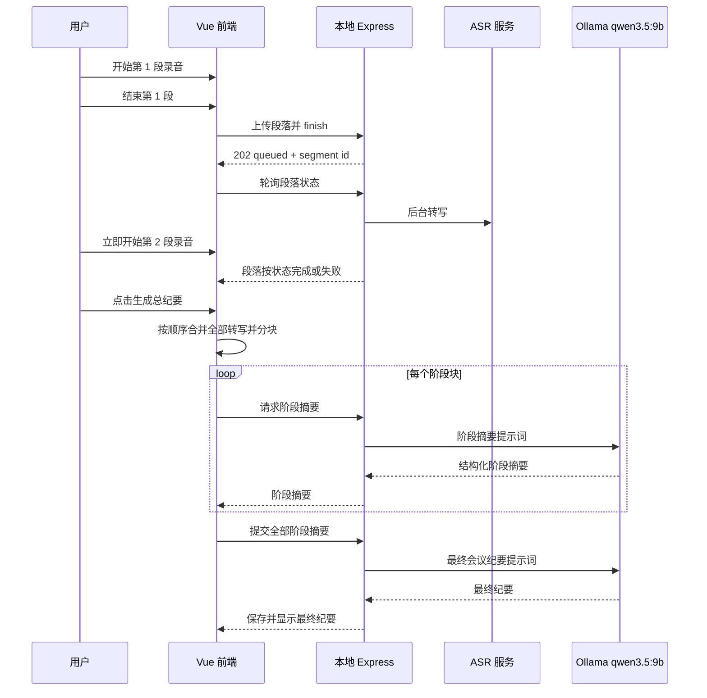

# 长会议分段录音与两级总结设计

## 背景

当前本地录音在每一段结束后会排队转写，但前端仍把这一段的转写和总结视为一次完整流程。长会议超过一小时后，用户需要等待上一段 ASR 完成才能继续录音，且完整原文直接交给 `qwen3.5:9b` 会带来上下文、耗时和结果稳定性风险。

本次改造只针对本地开发工作树，禁止执行正式部署。正式站点继续保持当前版本，直到本地验证完成并由用户另行确认发布。

## 目标

1. 每段录音结束后立即上传并排队 ASR，前端不等待 ASR 完成即可开始下一段录音。
2. 多段转写结果按录音顺序合并，不能按完成顺序覆盖或错序。
3. 单段任务独立显示 `排队中 / 转写中 / 已完成 / 失败`，失败段可以单独重试。
4. 用户明确点击“生成总纪要”后，系统先对长转写分块生成阶段摘要，再基于阶段摘要生成最终会议纪要。
5. 最终纪要默认控制在约 1500～3000 字；阶段块约 3000～5000 个汉字。字数是目标范围，不是硬截断规则。
6. 保留手动上传音频和现有短文本总结能力。

## 非目标

- 不自动根据“当前没有录音”判断会议已经结束。
- 不在每个录音段结束时调用总结模型。
- 不把所有原始长转写一次性发送给总结模型。
- 不在本次改造中部署 Cloudflare Pages、Wrangler 或修改正式站点。

## 用户流程



## 设计

### 1. 录音段任务

现有录音目录和 `job.json` 继续作为任务持久化边界。`finish` 接口只负责创建或返回 ASR 任务，不再在任务内部调用总结函数。任务完成结果包含 `recording`、`asr` 和格式化后的 `transcript`，不包含段级 `summary`。

前端维护当前会议批次的段列表：

```text
RecordingSegment {
  id: string
  index: number
  status: queued | processing | completed | failed
  transcript: string
  error: string
}
```

`index` 在开始录音时递增；后台任务完成顺序不影响展示和合并顺序。段任务只要完成上传并进入 `queued`，录音按钮就可用于下一段。上传失败仍阻止当前段进入队列，并提示用户重试该段。

### 2. 转写合并

前端把已完成段按 `index` 排序，以“录音第 N 段”作为清晰分隔，生成完整转写。未完成或失败段不参与总结；“生成总纪要”按钮在存在未完成或失败段时禁用，并显示原因。转写结果更新不会覆盖用户在编辑器中已经手动修改的非录音内容；本批次录音区域由段列表重新计算。

### 3. 长文本分块

分块器放在纯函数模块中，先按空行、句号、问号、感叹号和分号寻找边界，再以字符数作为上限。目标块大小为 3000～5000 个汉字，单个超长段落按硬上限切分。不会使用固定 6000 字作为模型要求，也不会为了凑字数截断一句话。

### 4. 两级总结

阶段摘要提示词要求只依据当前块，固定输出：

- 讨论事项
- 决策结论
- 待办事项、负责人、截止时间
- 风险和未决问题

前端按块顺序逐个调用阶段摘要接口，并显示 `第 N/M 个阶段摘要`。阶段摘要失败时停止最终总结，保留已经完成的阶段结果，并允许从失败块重试。

最终提示词只接收带序号的阶段摘要，要求去重、合并跨阶段的同一议题，保留金额、日期、负责人和截止时间，并输出既有的会议纪要 Markdown 结构。最终输出以约 1500～3000 个汉字为目标，内容完整性优先于机械字数。

### 5. 接口边界

本地 Express 新增两个短请求接口，避免单个长 HTTP 请求持续数分钟：

```text
POST /api/summarize/stage
body: { content: string, index: number, total: number }
returns: { summary: string, model: string }

POST /api/summarize/final
body: { summaries: Array<{ index: number, content: string }> }
returns: { summary: string, model: string }
```

原 `/api/summarize` 保留，继续支持短文本和手动整理。Cloudflare Functions 同步增加转发入口，供未来发布时保持 API 形状一致，但本次不执行发布。

## 错误处理

- 段上传失败：当前段标记为本地失败，不创建 ASR 任务，可单独重新上传/排队。
- ASR 失败：保留 `job.json` 的错误信息和段索引，其他段继续处理；最终总结前必须修复或明确移除失败段。
- 阶段摘要失败：不调用最终总结，保留已完成阶段摘要，重试从失败块开始。
- 最终总结失败：保留全部阶段摘要，允许只重试最终总结，不重复 ASR 和阶段摘要。
- 页面卸载：当前批次状态至少保留在组件内；录音任务本身继续由本地 `job.json` 运行，重新打开页面时不声称已完成，后续可扩展恢复接口。

## 测试与验收

- Node：验证段任务不再调用段级总结、多个任务可并行排队和查询、失败状态可重试、阶段/最终提示词和分块边界。
- UI：验证录音段完成排队后录音按钮可再次开始、段状态按序显示、乱序完成仍按序合并、未完成时不能生成总纪要、阶段摘要失败可重试。
- 构建：`npm.cmd run build` 通过。
- 本地冒烟：使用备用端口 `3011` 和 `8790`，不重启 `3001`/`8789`，不运行 `npm.cmd run deploy`、`wrangler pages deploy` 或其他正式发布命令。
